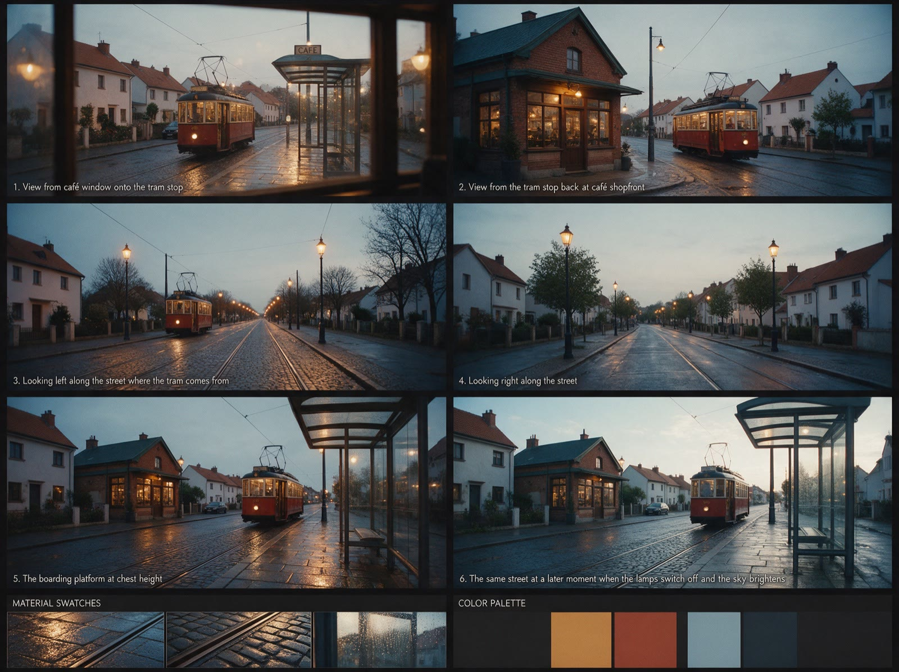
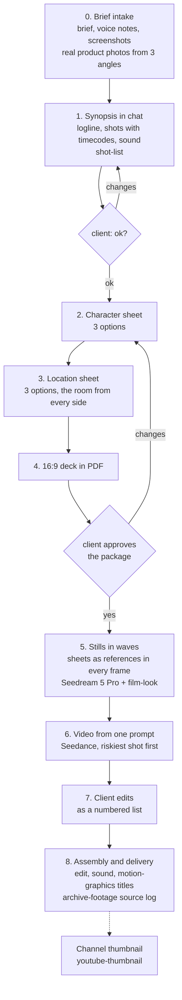

# AIVFX Content Kit

Twelve skills for Claude Code and Codex from AIVFX, a small AI video and automation studio: client AI videos, motion graphics, image and video generation in one consistent look, social media, a blog and websites.

Русская версия: [README.md](README.md)

## Install

You need Python 3 for the helper scripts and an agent: Claude Code, Codex or both. Motion graphics also need Node.js 22 or newer, ffmpeg and HyperFrames.

**1. As a Claude Code plugin.** Inside Claude Code:

```text
/plugin marketplace add shutckin/aivfx-content-kit
/plugin install aivfx-content-kit@aivfx
```

**2. With the skills CLI** (works for Claude Code, Codex and other agents it supports):

```bash
npx skills add shutckin/aivfx-content-kit
```

**3. From a clone, with the install script:**

```bash
git clone https://github.com/shutckin/aivfx-content-kit.git aivfx-content-kit
cd aivfx-content-kit
bash install.sh            # both: ~/.claude/skills and ~/.codex/skills
bash install.sh --claude   # Claude Code only
bash install.sh --codex    # Codex only
```

The script copies each folder from `skills/` into the agent's skills folder. If a skill with the same name already exists there, it is first moved to a backup in `~/.claude/skills-backups/<timestamp>/` (or `~/.codex/skills-backups/...`). Skills with other names are left alone. To update, run `git pull` and `bash install.sh` again.

Skills are picked up in a new agent session. To check, type something like "I got a brief for an AI ad for a coffee shop" and see whether `ai-video-concept` kicks in.

**About the language.** The skill instructions (`SKILL.md` bodies, templates, script messages) are written in Russian, because that is the language the studio works in. The skill descriptions the agent uses for matching are in English, and the agent answers in the language you write to it. You do not need to read Russian to use the kit.

## What it looks like

A finished studio video and real working files from the examples.

| Finished video: CollagenTrinity Tropic | Character sheet: three options for the hero |
|---|---|
| [](showcase/collagentrinity-tropic/reel.mp4) |  |
| AI ad for the NL brand, 9:16, 21 seconds. Click the contact sheet to open the video. [How it was made](showcase/collagentrinity-tropic/README.md). | Turnaround from four sides, the face from three angles, emotions, poses for the actual scenes, fabrics and palette. [All three options](examples/video/02a-character-sheet.md). |

| Location sheet: one street from six points | Frames generated from the approved sheets |
|---|---|
|  |  |
| Views from every side, two lighting states, textures and palette. [All three options](examples/video/02b-location-sheet.md). | Face, jacket, backpack, tram and buildings match the sheets with no manual retouching. [Prompts and command](examples/video/05-prompts.md). |

## The studio stack

The kit is not about "content in general". It is built around the tools the studio actually uses. Almost all of them can be swapped for alternatives, but the rules in the skills were tested on these.

| Area | Built on | Who does what |
|---|---|---|
| Running the project | Claude Code (or Codex): project folder, synopsis, prompts, layout, script checks, subagents for large batches | the agent; review and decisions stay with the owner |
| Stills and sheets | Higgsfield: **Seedream 5 Pro** as the main model for frames and character and location sheets, **Nano Banana** (Pro or 2) for editing a finished frame against a reference and running variations; the same Nano Banana through Flowith or a similar aggregator in the browser (some aggregator plans do not charge credits for it, check yours) | the agent generates after the owner says yes |
| Video | **Seedance** through Higgsfield: the whole video from one prompt; **Kling** as a fallback when Seedance cannot handle a specific motion | the agent |
| Music | **Suno** (or similar), when the synopsis calls for it | the agent writes the prompt, the owner listens |
| One look | `film-look` presets appended to every prompt, flagship **Dark Roast** | the agent; the owner approves the preset |
| Motion | **HyperFrames, extended by the studio**: a scene is an HTML composition animated with GSAP, the engine renders ProRes 4444 with alpha, and on top of it sit a one-file brand kit and a brief by scene roles | the agent builds, the owner approves the draft |
| Editing | DaVinci Resolve (or Premiere, Final Cut) | the owner or an editor |
| Social | **Instagram** and **Threads** (plus Pinterest) through the official APIs, **scheduled posting from a server** (GitHub Actions, a VPS) rather than from a laptop; text on carousels comes from a layout layer | the agent prepares a batch, the owner approves |
| Blog | articles live in the site repository; topics come from Search Console, Yandex Webmaster and real questions people ask; indexing through Search Console and IndexNow | the agent writes and checks, deploys only on the owner's word |
| Websites | **React or Next.js**, hosted on **Vercel** or an **nginx** server behind Cloudflare, **Supabase** database, form leads to **Telegram and Notion** through a server function | the agent builds and checks, deploys only on the owner's word |
| Measurement | **Yandex Metrica** with goals, **Search Console** and Yandex Webmaster, a custom `/go/` redirect with a click log in nginx | the agent pulls the numbers, the weekly decision is the owner's |
| Checks | 13 Python 3 scripts with no external dependencies | the agent runs them, the owner sees the output |

Every skill starts its `SKILL.md` with a "Runs on" block («На чём работает»): which tools, what turns into what, and who does what. The table above is assembled from those blocks.

The agent never publishes or sends anything on its own. Paid generations, sending work to a client, publishing and deploying happen only on the owner's explicit word.

## Concept studio pipeline

This is the core of the kit. The `ai-video-concept` skill runs a client ad or product AI video from brief to delivery. The name comes from the studio's internal pipeline, concept studio.

The most expensive mistake in an AI video is to start generating scenes right away. The model reinvents the hero and the room every time: the face drifts from frame to frame, the kitchen changes its furniture and window, the product packaging comes out invented. The first wave of frames goes straight to the bin.

So before the first frame of the video itself, the studio puts together a **preproduction package** and the client approves it:

- a **synopsis** in chat: what the viewer sees and feels, a shot table with timecodes, how each shot leads into the next, sound, and what was changed from the brief and why;
- a **character sheet**: one hero from every side, three options to choose from;
- a **location sheet**: one room from every side, three options;
- a 16:9 **deck** in one PDF: character and location, scenes in order, the ending, the work plan.

The package is always made, not only "if the client asks". A change at the synopsis stage costs a minute; a change in the finished video costs a new wave of generations.



The diamonds are where work waits for the client. Project state lives in one file (`status.md`): which stage, what is approved, what we are waiting for. A new agent session starts by reading it.

A few rules that carry most of the weight:

- **Approved sheets go in as references for every generation**, macro shots included: a close-up portrait of the hero cropped from the sheet, the location frame or sheet, and a real product photo or approved packshot. Three references, no more: past that the model starts averaging and the face weakens. Packaging is never generated from a text description.
- **The whole video is one Seedance prompt** with the full batch of approved frames: a header with everything that stays the same (hero, location, product, color, sound), then shots with timecodes and a short anchor name each, then the look from `film-look`. Writing "as in reference 4" does not work, because images reach the model in arbitrary order.
- **The riskiest shot goes first.** If a transition or a camera move does not work, the scene mechanics change. Bending the rest of the video around a failed shot costs more.
- **Edits become a numbered list** (number, shot, what to change, quote), confirmed with the client before work starts. An edit that contradicts the approved package is flagged as a new round, not an edit.

Where time gets lost:

- Generating without sheets: face and location drift, the whole wave is thrown away.
- JPEG references: in the Higgsfield CLI a JPEG upload fails with a storage signature error that only shows up in the log, the command itself reports success, and the generation silently runs without the reference. References are PNG only, and logs are read after every batch.
- Camera orbits in stills: image models do not understand an arc and rotate the hero on a chair instead. Camera movement is a job for the video model.
- Text inside generations: titles go on in the edit, frames leave space at the top.

| Stage | Skill | What it gives |
|---|---|---|
| 0-8, the whole pipeline | `ai-video-concept` | stage order, brief questionnaire, sheet contents, package and delivery checklists |
| 1. Synopsis | `shot-list` | shot table with timecodes and a source for every shot, duration check by script |
| 2-6. Sheets, stills, video | `film-look` | one look for every generation in the project, aspect ratio as a parameter only |
| 1 and 8. Archive, if needed | `archive-footage` | finding archival footage and a license log for delivery |
| 8. Assembly | `motion-graphics` | lower thirds, titles, end card with a transparent background |
| after delivery | `youtube-thumbnail` | thumbnail and title, if the video goes to a channel |

The full worked example, from brief to delivery: [examples/video/](examples/video/).

## Skills

### Video

Client videos and everything around them, from brief and storyboard to archive and motion. `ai-video-concept` leads; it calls the other three at its stages.

| Skill | What it does | Runs on | Inside |
|---|---|---|---|
| `ai-video-concept` | client AI video from brief to delivery: preproduction package, sheets, deck, stills in waves, video, edits, delivery | Claude Code, Seedream 5 Pro and Nano Banana through Higgsfield, Seedance, Kling, Suno, DaVinci Resolve | templates `brief-questions.md`, `character-sheet.md`, `location-sheet.md`, `preprod-checklist.md` |
| `shot-list` | storyboard from a script or voiceover: timecodes, shot type, source, pacing for the platform, derived lists | a markdown table, Seedream and Nano Banana for generated shots, Seedance for the whole video | `check_shotlist.py`, sample table |
| `archive-footage` | archival footage, photos and documents for a finished script: where to look, how to read a license, a source log | archive.org, Wikimedia Commons, open museum collections, yt-dlp (only where the platform rules or the file license allow downloading), ffmpeg | `sources-log.md` template |
| `motion-graphics` | lower thirds, chapter cards, numbers, Shorts hooks, end cards from a brand file | HyperFrames extended by the studio; GSAP, ffmpeg, ProRes 4444, DaVinci Resolve | `check_brand.py`, `brand.example.json`, `scenes.example.json` |

**Motion is built on HyperFrames**, an open engine from HeyGen where a scene is an HTML file with a GSAP timeline that renders to video. The engine itself provides compositions, browser preview, rendering to MP4, WebM and MOV ProRes 4444 with alpha (`--format mov`), its own `lint`, `check` and `validate` commands (text contrast included) and a registry of ready-made blocks. The studio adds on top: a one-file `brand.json` (colors, fonts, motion, spacing, safe zones), a video brief by scene roles (`hook`, `name`, `chapter`, `number`, `endcard`) so the same brief renders in another brand's style, motion described in a director's words and translated into the brand's numbers, drafts over real footage with a frame contact sheet, a black-frame check, and `check_brand.py` for the brand file.

### Generation

Images and frames for everything else: videos, article covers, thumbnails, carousels. What they share: the `film-look` look at the end of every prompt, and aspect ratio passed only as a model parameter.

| Skill | What it does | Runs on | Inside |
|---|---|---|---|
| `film-look` | one film look for image and video prompts: removes over-sharpening, the plastic skin and the HDR feel | Higgsfield (CLI or web): Seedream 5 Pro, Nano Banana, Seedance, Kling, Veo; Flowith or similar | `build_prompt.py`, `check_prompt.py`, 6 presets, `look-brief.md` questionnaire, 3 examples |
| `article-cover` | article covers: a frame of the article's one idea instead of a still life, a stop list, brand logos in the frame in a single pass, 2-3 options | Seedream 5 Pro through Higgsfield, Nano Banana for edits, PNG logos, webp | `check_cover.py`, `cover-brief.md` template |
| `youtube-thumbnail` | YouTube and Shorts thumbnail pack: 3-4 concepts of one idea, paired with the title, a consistent channel series | frames from the video as references, Seedream 5 Pro and Nano Banana, Photoshop for exact text | `check_thumb.py`, `thumb-brief.md` brief |

### Social and blog

The studio's feed and articles on the real stack, plus measuring whether people reached the goal. In both cases topics come from questions people actually ask.

| Skill | What it does | Runs on | Inside |
|---|---|---|---|
| `social-carousel` | Instagram and Threads carousels and posts for a week: topics from questions, frames, layout, a separate Threads post, server-side scheduled posting, a weekly review | Seedream 5 Pro or Nano Banana through Higgsfield, an HTML and CSS layout layer, Instagram Graph API, Threads API, Pinterest, cron on a server | `check_post.py`, `carousel-brief.md`, `week-plan.md`, sample batch |
| `blog-article` | an article from topic to deploy and measurement: synopsis with three angles, dated facts, text in waves, checks, indexing | Search Console, Yandex Webmaster, real questions, Claude Code with subagents, IndexNow; Wordstat and search suggestions as extras | `check_article.py`, `check_text.py`, `check_freshness.py`, `suggest.py`, templates `synopsis.md`, `facts.md`, `deploy-queue-entry.md` |
| `site-analytics` | whether Metrica really counts visits, goals, a `/go/` redirect with a click log, a weekly report | Yandex Metrica, Search Console, Yandex Webmaster, nginx | `clicks_report.py`, `go-redirect.nginx.conf`, a Metrica reference setup, `weekly-report.md` |

The main social pitfalls the skill covers: Threads rejects text longer than 500 characters while Instagram takes 2200, so one caption for both channels fails on Threads after Instagram has already posted. A published Instagram post cannot be deleted through the API, so retrying the publish step after a network drop is not allowed. A laptop goes to sleep and silently misses its cron, so a server does the posting.

### Sites

A website for a studio or a small business, built by the agent from brief to deploy queue, with a security check before going live.

| Skill | What it does | Runs on | Inside |
|---|---|---|---|
| `website-build` | a site from description to deploy: a one-screen brief, references, build, browser check on phone and desktop, design audit, deploy queue | Claude Code, React or Next.js, Vercel or an nginx server behind Cloudflare, leads to Telegram and Notion | templates `brief.md`, `deploy-queue.md` |
| `security-check` | a plain-language security audit of your own site: keys in code and in git history, database access, forms, headers; report first, fixes only after a yes | Supabase (RLS policies), `.env` and hosting variables, git history, nginx or Cloudflare | `scan_secrets.py` |

## Film look

The look is a short block of text appended unchanged to every prompt in a project. It describes the shot the way a cinematographer would: camera, lens, film stock, grain, contrast. Models know what real cameras produce and pull the image toward that instead of their own "enhancement".

Three levels:

1. **Core.** Always, in any model: camera, lens, film stock, grain, soft contrast, ending with `no sharpening, no HDR`. This is what fixes over-sharpening and plastic skin.
2. **Grade.** On by default, turned off with `--no-grade` for bright interiors and product shots in brand colors (a warm grade pushes them into yellow monochrome), for a dark scene with a single warm lamp (it turns into brown mush), and for cold, monochrome or neon styles.
3. **Video block.** Video only: camera movement, plus a line about natural performance when people speak.

Six presets ship with the kit. The flagship `dark-roast` is the studio's own look: 35 mm, Kodak Vision3 500T, warm skin, cool window light, for people, interiors, food and lifestyle. The others are `neutral-product` (the same core without a grade, for product shots and brand colors), `nordic-cold`, `neon-night`, `documentary-16mm` and `silver-bw`.

Aspect ratio goes **only into the model parameter**, never into the text: in the text it fights the parameter and the frame gets cropped wrong. The script strips it from the scene, along with words like `8k` and `ultra detailed`.

Real output for a still in Seedream:

```text
$ python3 skills/film-look/scripts/build_prompt.py --preset dark-roast --model seedream --mode photo --aspect 16:9 "A barista pulls an espresso shot by the window of a small coffee shop at morning, steam over the cup, 8k, 3:4"
Внимание: убрал из текста сцены соотношение сторон: 3:4. Передавай его параметром модели (--aspect).
Внимание: убрал слова, которые ломают лук: 8k
A barista pulls an espresso shot by the window of a small coffee shop at morning, steam over the cup. Shot on Arricam LT with Cooke S4/i primes, 35mm Kodak Vision3 500T, T2.8, shallow depth of field, halation on highlights, fine organic grain, lifted milky blacks, low contrast, no sharpening, no HDR. Dark Roast grade: terracotta-warm skin as the hero tone, honey-oak wood and amber tungsten pools, matte charcoal blacks, cool blue-grey window light, chromatic blue shadows.

Параметр модели: aspect_ratio=16:9
```

The two warnings (in Russian) say that the script removed `3:4` from the scene text and asks for it as a parameter, and that it removed `8k` as a look-breaking word. The last line is not part of the prompt: it is the value for the aspect ratio field in the model's interface. To list presets with hints on when to use each: `python3 skills/film-look/scripts/build_prompt.py --list`.

## Examples

All examples are fictional and marked as such: brands, people, numbers. Script output in the examples is real. The example files are in Russian.

- **[examples/video/](examples/video/)**: a 30-second vertical ad for a small coffee shop through the whole concept studio pipeline: filled brief, three directions and a synopsis, character and location sheets with three options each, the deck, a 12-shot table, prompts built with `build_prompt.py`, a source log, a brand file and motion scenes, two rounds of edits and the delivery checklist.
- **[examples/thumb/](examples/thumb/)**: a thumbnail pack for a video: a brief with four concepts of one idea, a prompt with the look and `check_thumb.py` output.
- **[examples/](examples/)** (root): one blog article through `blog-article`, from topic to weekly measurement: brief, synopsis, facts, cover, the article, the output of every check (including a real freshness finding), the deploy queue, a click log with its report, and a weekly report with one decision.
- **[examples/site/](examples/site/)**: a one-page site for a shoe repair shop: brief, browser check on phone and desktop with two issues found, a security audit with `scan_secrets.py` output on fake keys, and the deploy queue.

## Scripts

All scripts are Python 3 with the standard library only. Exit codes are the same everywhere: 0 clean, 1 violations found, 2 the script could not run (missing file, bad arguments), so they can gate a review or a deploy. Run the commands from the repository root; each one was run on the bundled examples. Script messages are in Russian.

| Skill | Command | What it checks |
|---|---|---|
| `shot-list` | `python3 skills/shot-list/scripts/check_shotlist.py examples/video/04-shotlist.md --target 30 --max 3` | total duration against the target (`--tolerance`, 1 s by default), empty cells, shots longer than `--max`, source from the allowed list, back-to-back timecodes |
| `motion-graphics` | `python3 skills/motion-graphics/scripts/check_brand.py examples/video/07-brand.json` | required fields, hex colors, contrast of at least 4.5:1, no monospace fonts, font sizes, timings, safe zones |
| `film-look` | `python3 skills/film-look/scripts/build_prompt.py --preset dark-roast --model seedream --mode photo --aspect 3:4 "scene"` | not a check but a builder: scene plus look for the model, aspect ratio separately; `--list`, `--no-grade`, `--file` |
| `film-look` | `python3 skills/film-look/scripts/check_prompt.py examples/04-cover-prompt.txt --preset dark-roast --mode photo` | the full look core, aspect ratio in the text, look-breaking words, a video block in a still |
| `article-cover` | `python3 skills/article-cover/scripts/check_cover.py cover.webp --width 1280 --ratio 16:9 --prompt prompt.txt` | file width and proportions (PNG, JPEG, WebP), stop list in the prompt, aspect ratio in the text, missing look |
| `youtube-thumbnail` | `python3 skills/youtube-thumbnail/scripts/check_thumb.py finals/*.jpg` | 1280x720 (or 1080x1920 with `--shorts`), up to 2 MB, Latin file name; `--make-test` creates a gray PNG to test the script itself |
| `social-carousel` | `python3 skills/social-carousel/scripts/check_post.py skills/social-carousel/examples/batch.example.json` | Threads up to 500 characters and not a copy of Instagram, Instagram up to 2200 and 30 hashtags, alt texts, repeated layouts, long dashes; with `--publish` also "approved" and https URLs |
| `blog-article` | `python3 skills/blog-article/scripts/check_article.py examples/05-article.md` | front matter, description up to 160, FAQ with "?" on questions, H2 count, dashes, empty links, length |
| `blog-article` | `python3 skills/blog-article/scripts/check_text.py examples/05-article.md` | long dashes and stop-list phrases (bureaucratese, clichés, invented experience); your own list with `--stoplist` |
| `blog-article` | `python3 skills/blog-article/scripts/check_freshness.py examples examples/versions.json --today 2026-10-08` | old versions next to a service name, promo deadlines, last year in a heading, an outdated version table |
| `blog-article` | `python3 skills/blog-article/scripts/suggest.py "seedance" --dry-run` | not a check but a Google suggestions collector to CSV (`--out`, `--hl en`); `--dry-run` prints the query plan without network |
| `site-analytics` | `python3 skills/site-analytics/scripts/clicks_report.py examples/08-clicks.log` | clicks by partner, page, placement and country, bots and repeats filtered out, clicks without a tag (`--days`, `--window`) |
| `security-check` | `python3 skills/security-check/scripts/scan_secrets.py your-project/` | key-like strings in files and in git history, `.env` in git; values printed masked; `--no-git` skips history |

Exit code 0 does not mean "the work is good": the scripts see numbers, words and characters, not meaning. You still need to look with your own eyes.

## FAQ

### Do I need Higgsfield?

No. Higgsfield is the studio's main gateway to the models (Seedream 5 Pro, Nano Banana, Seedance, Kling), so the command examples and pitfalls are written for it. The rules work with any service that has these or similar models: the model's own site, Flowith or another aggregator. The "where to put the look" table in `film-look` is organized by model, not by service.

### Does it work without Claude Code?

The skills are written for Claude Code and Codex: both find a skill by its description and follow its `SKILL.md`. With another agent, have it read the relevant `SKILL.md` at the start of the task. The scripts also work on their own from a terminal, with no agent at all.

### Can I use my own look?

Yes. Copy a similar preset in `skills/film-look/presets/`, give it your name and change the fields. If the brand has fixed colors, start from a preset without a grade or build with `--no-grade`. To start from scratch, use the questionnaire in `skills/film-look/templates/look-brief.md`; the steps are in [docs/how-skills-work.md](docs/how-skills-work.md).

### Will the agent publish or deploy on its own?

No. The agent prepares, runs the checks and puts the result in a queue: `DEPLOY-QUEUE.md` for a site or blog, a batch file for social media. Publishing, deploying and sending to a client happen only on the owner's explicit word ("deploy", "publish", "send"). Paid generations also wait for a yes.

### The skill does not kick in. What now?

Check that the folder is in `~/.claude/skills/<name>/` (or `~/.codex/skills/<name>/`), that it contains `SKILL.md`, and that you started a new session. With the plugin install, check that the plugin is enabled in `/plugin`. If the agent still does not recognize the task, call the skill by name: "work by ai-video-concept", or `/ai-video-concept` in Claude Code.

## Dates

Models, tool flags, platform limits and service behavior in the skills were checked in September and October 2026. Anything likely to go stale is marked in each skill under "What goes stale first" ("Что устаревает первым"): recheck it before relying on it.

## Credits

Motion is built on the open [HyperFrames](https://hyperframes.heygen.com) engine from HeyGen. Some writing ideas were borrowed from open skill sets and rewritten from scratch: [entrepreneur-claude-skills](https://github.com/mfwarren/entrepreneur-claude-skills) by Matt Warren (MIT) and no-ai-slop by Peter Yang (MIT).

## License and author

MIT, see [LICENSE](LICENSE).

Author: Artem Shutkin, AIVFX studio, [aivfx.ru](https://aivfx.ru).

Business inquiries: [connect@shootkin.com](mailto:connect@shootkin.com).
