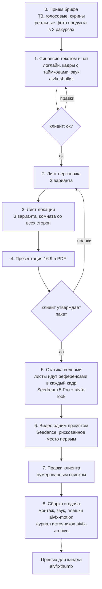
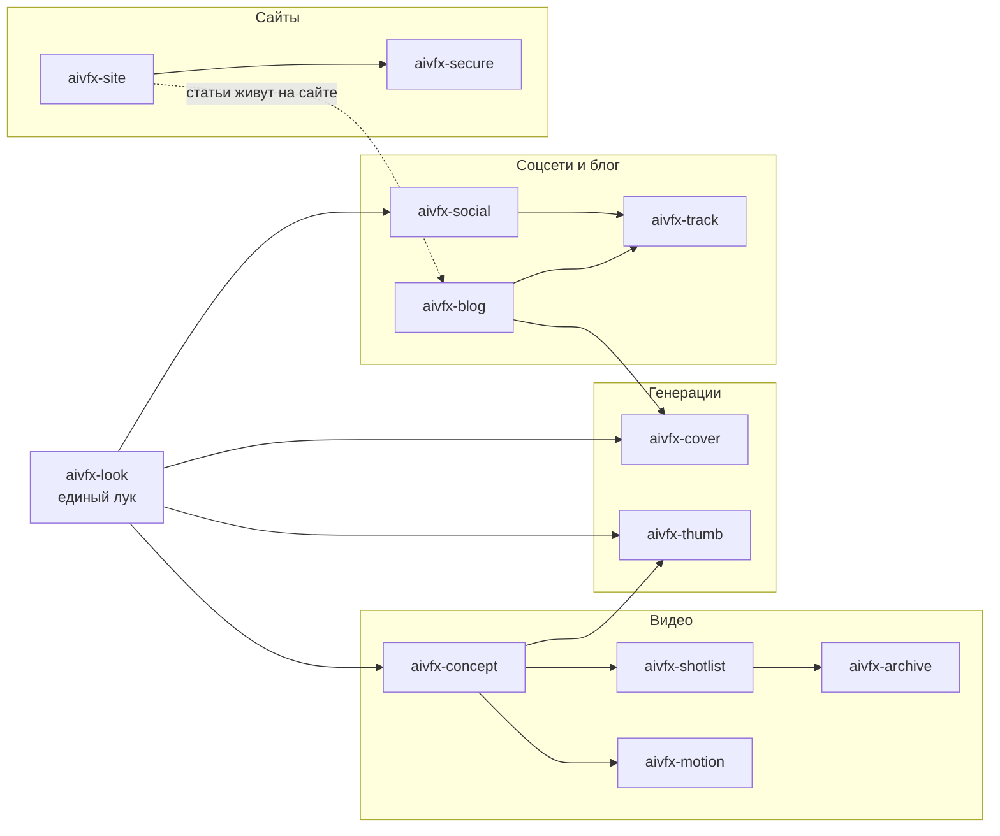

# AIVFX Content Kit

Скиллы студии AI-видео и автоматизаций AIVFX для Claude Code и Codex. С ними агент работает так, как работает студия: клиентские AI-ролики, моушен, генерации с единым луком, соцсети, блог и сайты.

12 скиллов в четырёх направлениях: **Видео**, **Генерации**, **Соцсети и блог**, **Сайты**. Каждый скилл можно взять отдельно, но лучше всего они работают связкой, как в студии.

Агент ничего не публикует и не отправляет сам. Платные генерации, отправка клиенту, публикация и выкат только по прямому слову владельца.

## Реальные связки студии

Набор не про «контент вообще». Он собран вокруг инструментов, на которых студия реально делает работу. Почти все заменяемы аналогами, но правила в скиллах проверены именно на этих.

| Направление | На чём сделано | Кто что делает |
|---|---|---|
| Ведёт проект | Claude Code (или Codex): папка проекта, синопсис, промпты, вёрстка, проверки скриптами, субагенты на большие партии | агент, ревью и решения за владельцем |
| Кадры и листы | Higgsfield: **Seedream 5 Pro** основная модель для кадров и листов персонажа и локации, **Nano Banana** (Pro или 2) для правки готового кадра по референсу и прогона вариантов; тот же Nano Banana через Flowith или аналог в браузере (на части тарифов агрегаторов без списания кредитов, проверь свой тариф) | агент генерирует после «да» владельца |
| Видео | **Seedance** через Higgsfield: весь ролик одним промптом; **Kling** запасной, если Seedance не вытягивает движение | агент |
| Музыка | **Suno** (или аналог), если она нужна по синопсису | агент пишет промпт, владелец слушает |
| Единый лук | пресеты `aivfx-look` хвостом каждого промпта, флагман **Dark Roast** | агент, пресет утверждает владелец |
| Моушен | **HyperFrames, доработанный студией**: сцена это HTML-композиция с анимацией GSAP, рендер движка в ProRes 4444 с прозрачным фоном, поверх него бренд в одном файле и бриф по ролям сцен | агент собирает, владелец утверждает черновик |
| Монтаж | DaVinci Resolve (или Premiere, Final Cut) | владелец или монтажёр |
| Соцсети | **Instagram** и **Threads** (и Pinterest) через официальные API, публикация **по расписанию с сервера** (GitHub Actions, VPS), а не с ноутбука; текст на карусели ставит слой вёрстки | агент собирает партию, владелец утверждает |
| Блог | статьи в репозитории сайта, темы из Search Console, Вебмастера и живых вопросов людей, индексация через Search Console и IndexNow | агент пишет и проверяет, выкат по слову |
| Сайты | **React или Next.js**, хостинг **Vercel** или свой сервер с **nginx** за Cloudflare, база **Supabase**, заявки с формы в **Telegram и Notion** через серверную функцию | агент собирает и проверяет, выкат по слову |
| Замер | **Яндекс Метрика** с целями, **Search Console** и Вебмастер, свой переходник `/go/` с журналом кликов в nginx | агент снимает цифры, решение на неделю за владельцем |
| Проверки | 13 скриптов на Python 3 без внешних библиотек | агент гоняет, владелец видит вывод |

У каждого скилла в начале `SKILL.md` есть блок «На чём работает»: какие инструменты, что из чего получается и кто что делает. Таблица выше собрана из этих блоков.

## Как это выглядит

Готовый ролик студии и настоящие рабочие файлы из примеров.

| Готовый ролик: CollagenTrinity Tropic | Листы персонажа: три варианта героя |
|---|---|
| [](showcase/collagentrinity-tropic/reel.mp4) |  |
| Рекламный AI-ролик для бренда NL, 9:16, 21 секунда. Нажми на раскадровку, чтобы открыть видео. [Как сделан](showcase/collagentrinity-tropic/README.md). | Разворот с четырёх сторон, лицо в трёх ракурсах, эмоции, позы под сцены, ткани и палитра. [Все три варианта](examples/video/02a-character-sheet.md). |

| Лист локации: одна улица с шести точек | Кадры по утверждённым листам |
|---|---|
|  |  |
| Виды со всех сторон, два состояния света, фактуры и палитра. [Все три варианта](examples/video/02b-location-sheet.md). | Лицо, куртка, рюкзак, трамвай и дома совпали с листами без ручной правки. [Промпты и команда](examples/video/05-prompts.md). |

## Concept studio: как студия делает клиентский AI-ролик

Это главное, что умеет набор. Скилл `aivfx-concept` ведёт рекламный или продуктовый AI-ролик для клиента от брифа до сдачи. Название от внутреннего конвейера студии: concept studio.

### Зачем пакет до первого кадра

Самая дорогая ошибка в AI-ролике: начать генерировать сцены сразу. Модель каждый раз придумывает героя и комнату заново. Лицо плывёт от кадра к кадру, у кухни меняются мебель и окно, упаковка продукта выходит выдуманной. Первая волна кадров уходит в корзину целиком, а клиент видит, что «герой каждый раз другой».

Поэтому до первого кадра самого ролика студия собирает **препродакшн-пакет**, и клиент его утверждает:

- **синопсис** текстом в чат: что зритель видит и чувствует, покадровая таблица с таймкодами, как шот переходит в шот, звук, что изменено относительно ТЗ и почему;
- **лист персонажа**: один герой со всех сторон, три варианта на выбор;
- **лист локации**: одна комната со всех сторон, три варианта на выбор;
- **презентация** 16:9 в одном PDF: персонаж и локация, сцены по порядку, финал, план работ.

Пакет собирается всегда, а не «если клиент попросит». Правка на этапе синопсиса стоит минуту, правка готового видео стоит новой волны генераций.

### Этапы



Ромбы это места, где работа стоит, пока клиент не ответил. Состояние проекта живёт в одном файле (`status.md`): какой этап, что утверждено, чего ждём. Новая сессия агента начинает с него.

### Листы персонажа и локации: зачем они в каждой генерации

**Лист персонажа** (character reference sheet) это один герой на одном листе: разворот в полный рост спереди, в три четверти, сбоку и со спины, лицо в нескольких ракурсах, эмоции и позы именно под сцены этого ролика. Если герой в кадре ест, в позах есть ложка. Три варианта отличаются лицом, причёской и одеждой. После выбора нормально пройти ещё 2-3 итерации.

**Лист локации** (location reference sheet) это одна комната со всех сторон: общий план от каждой стены, детали, свет. Одного кадра комнаты мало: на смене точки камеры модель достроит свою стену и своё окно.

Утверждённые листы подаются референсами **в каждую** генерацию, включая макро. Что грузить:

- крупный портрет героя, вырезанный из листа (на сетке лицо занимает пару процентов кадра, и модель его не считывает);
- кадр или лист локации;
- реальное фото продукта или утверждённый packshot. Упаковку по текстовому описанию не генерят никогда: выйдет выдуманный продукт.

Это три обязательных референса, и больше не добавляй: модель начинает усреднять, и лицо слабеет.

### Видео одним промптом

Студия не клеит ролик из отдельных клипов. Весь ролик идёт в Seedance **одним промптом** вместе со всем батчем утверждённых кадров:

- шапка: герой, локация, продукт, цвет, звук, то есть всё, что одинаково во всех шотах;
- шоты с таймкодами, у каждого короткое имя-якорь («коробка», «саше», «финал»);
- хвостом лук из `aivfx-look`.

Писать «как на референсе 4» бесполезно: картинки уходят в модель в произвольном порядке. Консистентность держит описание в шапке.

### Рискованное место первым

Самая сложная часть ролика (переход, сложное движение камеры, мелкий текст на продукте) пробуется первой. Если не выходит, меняется механика сцены, например облёт камеры заменяют перекрытием кадра предметом. Подгонять под неудачную сцену весь остальной ролик дороже.

### Правки списком

Правки приходят голосовыми, скринами, кусками в разных сообщениях. Агент разбирает их в нумерованный список (номер, кадр, что поменять, цитата) и сначала подтверждает: «правильно понял, вот 7 пунктов?». Правка, которая противоречит утверждённому пакету, помечается отдельно: это новый круг, а не правка. Отчёт идёт по тем же номерам.

### Где теряется время

- **Генерация без листов.** Лицо и локация плывут, волну выкидывают целиком.
- **JPEG-референс.** В Higgsfield CLI загрузка JPEG падает с ошибкой подписи хранилища в логе, но сама команда ошибку не возвращает, и генерация молча уходит без референса. Поэтому референсы только PNG, после каждой пачки читать логи.
- **Одноимённые файлы.** Из загрузок легко взять не тот кадр. Новая версия получает новое имя, перед подстановкой сверяется контрольная сумма.
- **Облёт камеры в статике.** Модель картинок не понимает дугу и крутит героя на стуле. Движение камеры это задача видеомодели.
- **i2i от кадра со старой деталью.** Длину волос или рукава так не поменять: картинка перебивает текст.
- **Текст в генерации.** Титры только на монтаже, в кадрах оставлен воздух сверху.
- **Забытая пересборка презентации.** Картинки вшиты в файл: поменял кадр на диске, PDF соберётся со старым.

### Какие скиллы на каком этапе

| Этап | Скилл | Что даёт |
|---|---|---|
| 0-8, весь конвейер | `aivfx-concept` | порядок этапов, опросник брифа, составы листов, чек-лист пакета и сдачи |
| 1. Синопсис | `aivfx-shotlist` | покадровая таблица с таймкодами и источником каждого кадра, проверка хронометража скриптом |
| 2-6. Листы, статика, видео | `aivfx-look` | один лук на все генерации проекта, соотношение сторон только параметром |
| 1 и 8. Архив, если нужен | `aivfx-archive` | поиск архивных кадров и журнал лицензий в сдачу |
| 8. Сборка | `aivfx-motion` | плашки, титры, финальная карточка с прозрачным фоном |
| после сдачи | `aivfx-thumb` | превью и заголовок, если ролик идёт на канал |

Пример целиком, от брифа до сдачи: [examples/video/](examples/video/).

## Четыре направления

### Видео

Клиентские ролики и всё, что вокруг них: от брифа и раскадровки до архива и моушена. Главный здесь `aivfx-concept`, остальные три он зовёт на своих этапах.

| Скилл | Что делает | На чём работает | Срабатывает на | Что внутри |
|---|---|---|---|---|
| `aivfx-concept` | клиентский AI-ролик от брифа до сдачи: препродакшн-пакет, листы, презентация, статика волнами, видео, правки, сдача | Claude Code, Seedream 5 Pro и Nano Banana через Higgsfield, Seedance, Kling, Suno, DaVinci Resolve | «вот бриф», «новый клиент», «концепт студия», «лист персонажа», «правки от клиента» | шаблоны `brief-questions.md`, `character-sheet.md`, `location-sheet.md`, `preprod-checklist.md` |
| `aivfx-shotlist` | раскадровка из сценария или закадра: таймкоды, тип кадра, источник, темп под площадку, производные списки | таблица markdown, Seedream и Nano Banana для кадров `генерация`, Seedance для ролика целиком | «раскадровка», «разбей сценарий на кадры», «shot list» | `check_shotlist.py`, пример таблицы |
| `aivfx-archive` | архивный футаж, фото и документы под готовый сценарий: где искать, как читать лицензию, журнал источников | archive.org, Wikimedia Commons, открытые музейные фонды, yt-dlp (только там, где скачивание разрешают правила площадки или лицензия файла), ffmpeg | «найди архив», «футаж под сценарий», «какая лицензия» | шаблон `sources-log.md` |
| `aivfx-motion` | плашки, главы, цифры, хуки для Shorts, финальные карточки по бренд-файлу | HyperFrames, доработанный студией; GSAP, ffmpeg, ProRes 4444, DaVinci Resolve | «сделай плашку», «титры», «хук для шортс», «сделай на хайперфреймс» | `check_brand.py`, `brand.example.json`, `scenes.example.json` |

**Моушен построен на HyperFrames.** HyperFrames это открытый движок от HeyGen: сцена там HTML-файл с таймлайном GSAP, рендер в видео. Сам движок даёт композиции, предпросмотр в браузере, рендер в MP4, WebM и MOV ProRes 4444 с прозрачностью (`--format mov`), свои проверки `lint`, `check` и `validate` (в том числе контраст текста) и реестр готовых блоков. Студия добавила поверх:

- бренд в одном файле `brand.json`: цвета, шрифты, движение, отступы, безопасные зоны; правила бренда печатаются перед рендером;
- бриф ролика по ролям сцен (`hook`, `name`, `chapter`, `number`, `endcard`) вместо ручной вёрстки каждой композиции: смени бренд, и тот же бриф соберётся в другом стиле;
- движение словами режиссёра («имя поднимается за линией, должность проявляется следом»), агент переводит их в числа бренда;
- библиотеку ролей и шаблонов: роль переводится в шаблон конкретного бренда;
- черновик поверх настоящего футажа и контактный лист кадров, а не оценку на чёрном фоне;
- сравнение финала с черновиком по тёмным кадрам и поиск чёрных кадров;
- проверку бренд-файла скриптом `check_brand.py`;
- локальные шрифты и локальный GSAP внутри композиции.

### Генерации

Картинки и кадры для всего остального: роликов, обложек статей, превью, каруселей. Общее у всех одно: лук из `aivfx-look` хвостом каждого промпта и соотношение сторон только параметром модели.

| Скилл | Что делает | На чём работает | Срабатывает на | Что внутри |
|---|---|---|---|---|
| `aivfx-look` | единый плёночный лук для промптов картинок и видео: убирает перешарп, пластик и HDR-вид | Higgsfield (CLI или веб): Seedream 5 Pro, Nano Banana, Seedance, Kling, Veo; Flowith или аналог | «собери лук», «убери перешарп», «вшей лук в промпт» | `build_prompt.py`, `check_prompt.py`, 6 пресетов, опросник `look-brief.md`, 3 примера |
| `aivfx-cover` | обложки статей: кадр одной мысли вместо натюрморта, стоп-лист, логотипы в кадре за один проход, 2-3 варианта | Seedream 5 Pro через Higgsfield, Nano Banana для правки, PNG-логотипы, webp | «сделай обложку», «картинку к статье», «hero для страницы» | `check_cover.py`, шаблон `cover-brief.md` |
| `aivfx-thumb` | пак превью YouTube и Shorts: 3-4 концепта одной мысли, связка с заголовком, серия канала | кадры ролика как референсы, Seedream 5 Pro и Nano Banana, Photoshop для кириллицы | «сделай превью», «упакуй ролик», «thumbnail» | `check_thumb.py`, бриф `thumb-brief.md` |

**Шесть пресетов лука.** Флагман `aivfx-dark-roast`: фирменный лук студии, 35 мм, плёнка Kodak Vision3 500T, тёплая кожа, холодный свет из окна. Для людей, интерьера, еды, lifestyle. Остальные: `neutral-product` (то же ядро без грейда, для предметки и фирменных цветов), `nordic-cold`, `neon-night`, `documentary-16mm`, `silver-bw`.

### Соцсети и блог

Лента и статьи студии на реальной связке, плюс замер, дошли ли люди до цели. Темы в обоих случаях берутся из вопросов, которые люди правда задают, а не из головы.

| Скилл | Что делает | На чём работает | Срабатывает на | Что внутри |
|---|---|---|---|---|
| `aivfx-social` | карусели и посты Instagram и Threads на неделю: темы из вопросов, кадры, вёрстка, отдельный пост Threads, публикация с сервера, ревизия | Seedream 5 Pro или Nano Banana через Higgsfield, слой вёрстки HTML и CSS, Instagram Graph API, Threads API, Pinterest, крон на сервере | «сделай карусель», «пост в тредс», «контент-план на неделю», «автопостинг» | `check_post.py`, `carousel-brief.md`, `week-plan.md`, пример партии |
| `aivfx-blog` | статья от темы до выката и замера: синопсис с тремя углами, факты с датой, текст волнами, проверки, индексация | Search Console, Вебмастер, живые вопросы, Claude Code с субагентами, IndexNow; Вордстат и подсказки дополнительно | «напиши статью», «о чём писать», «обнови старую статью», «убери нейросеть из текста» | `check_article.py`, `check_text.py`, `check_freshness.py`, `suggest.py`, шаблоны `synopsis.md`, `facts.md`, `deploy-queue-entry.md` |
| `aivfx-track` | работает ли Метрика на самом деле, цели, переходник `/go/` с журналом кликов, недельный отчёт | Яндекс Метрика, Search Console, Вебмастер, nginx | «проверь Метрику», «сколько кликов по партнёрке», «что дал выкат» | `clicks_report.py`, `go-redirect.nginx.conf`, эталон Метрики, `weekly-report.md` |

Главные грабли соцсетей, которые скилл закрывает: Threads отказывает при тексте длиннее 500 знаков, а Instagram берёт 2200, поэтому одна подпись в оба канала роняет Threads уже после Instagram. Опубликованный пост Instagram через API не удалить, значит повтор шага публикации при обрыве сети запрещён. Ноутбук засыпает и пропускает крон молча, поэтому публикует сервер.

### Сайты

Сайт студии или маленького бизнеса силами агента: от брифа до очереди выката, с проверкой безопасности перед выкатом.

| Скилл | Что делает | На чём работает | Срабатывает на | Что внутри |
|---|---|---|---|---|
| `aivfx-site` | сайт от описания до выката: бриф на один экран, референсы, сборка, проверка в браузере на телефоне и компьютере, дизайн-аудит, очередь выката | Claude Code, React или Next.js, Vercel или свой сервер с nginx за Cloudflare, заявки в Telegram и Notion | «сделай сайт», «собери лендинг», «добавь раздел на сайт» | шаблоны `brief.md`, `deploy-queue.md` |
| `aivfx-secure` | аудит безопасности своего сайта простыми словами: ключи в коде и в истории git, доступ к базе, формы, заголовки; сначала отчёт, правки после «да» | Supabase (правила RLS), `.env` и переменные хостинга, история git, nginx или Cloudflare | «проверь безопасность», «нет ли ключей в коде», «ключ утёк» | `scan_secrets.py` |

## Как направления связаны



- **Лук идёт во все генерации:** кадры ролика, обложки, превью, карусели. Один пресет на проект, иначе кадры выглядят как из разных фильмов.
- **Concept зовёт motion и thumb:** плашки и титры на сборке, превью, если ролик идёт на канал.
- **Social и blog сдают замер в track:** через неделю после выката видно, дошли ли люди до цели.
- **Blog берёт обложки у cover,** а сами статьи живут в репозитории сайта, который собран по `aivfx-site`.

## Лук для генераций

Лук это короткий блок текста, который дописывается к каждому промпту проекта без изменений. Он описывает съёмку языком оператора: камера, оптика, плёнка, зерно, контраст. Модель знает, как выглядят настоящие камеры, и тянет картинку к ним, а не к своему «улучшайзингу».

Три уровня:

1. **Ядро.** Всегда, в любой модели: камера, оптика, плёнка, зерно, мягкий контраст и в конце `no sharpening, no HDR`. Лечит перешарп и пластик.
2. **Грейд.** По умолчанию включён, снимается флагом `--no-grade` в двух случаях: светлые интерьеры и предметка с фирменными цветами (тёплый грейд утягивает в жёлтый монохром) и тёмная сцена с одной тёплой лампой (коричневое мыло). И ещё при холодном, монохромном или неоновом стиле.
3. **Видео-блок.** Только для видео: движение камеры, а если в кадре говорят, строка про живую игру.

Соотношение сторон **только параметром модели**, никогда в тексте: в тексте оно спорит с параметром, и кадр режется мимо. Скрипт сам вырезает его из сцены вместе со словами вроде `8k, ultra detailed`.

Реальный вывод сборки для кадра ролика в Seedance:

```text
$ python3 skills/aivfx-look/scripts/build_prompt.py --preset aivfx-dark-roast --model seedance --mode video --aspect 9:16 "A guest waits at a tram stop at dawn, steam rises from a paper cup, 8k ultra detailed, 16:9"
Внимание: убрал из текста сцены соотношение сторон: 16:9. Передавай его параметром модели (--aspect).
Внимание: убрал слова, которые ломают лук: 8k, ultra detailed
A guest waits at a tram stop at dawn, steam rises from a paper cup.

Shot on Arricam LT with Cooke S4/i primes, 35mm Kodak Vision3 500T, T2.8, shallow depth of field, halation on highlights, fine organic grain, lifted milky blacks, low contrast, no sharpening, no HDR. Dark Roast grade: terracotta-warm skin as the hero tone, honey-oak wood and amber tungsten pools, matte charcoal blacks, cool blue-grey window light, chromatic blue shadows. Handheld with micro-drift, never locked off.

Параметр модели: aspect_ratio=9:16
```

Последняя строка не часть промпта: это значение для поля соотношения сторон в интерфейсе модели. Список пресетов с подсказками, когда какой брать: `python3 skills/aivfx-look/scripts/build_prompt.py --list`.

## Примеры

Все примеры вымышленные и помечены «условно»: бренды, люди, цифры. Картинок и видео в репозитории нет, где был бы кадр, он описан словами. Вывод скриптов в примерах настоящий.

**[examples/video/](examples/video/)** - 30-секундная вертикальная реклама маленькой кофейни через весь конвейер concept studio:

1. `01-brief.md` - заполненный опросник: фото продукта в трёх ракурсах, кто согласует, разбор референса.
2. `02-concept.md` - три направления на выбор и синопсис в чат.
3. `02a-character-sheet.md` и `02b-location-sheet.md` - листы персонажа и локации по три варианта, выбор, что идёт в каждую генерацию.
4. `03-preprod.md` - презентация по слайдам, план волн и риски.
5. `04-shotlist.md` - таблица 12 кадров на 30 секунд, съёмочный план и план генераций.
6. `05-prompts.md` - промпты, собранные `build_prompt.py`, и их проверка.
7. `06-sources-log.md` - журнал источников.
8. `07-brand.json` и `08-scenes.json` - бренд-файл и сцены графики для `aivfx-motion`.
9. `09-revisions.md` - два круга правок списком, «это новый круг», чек-лист сдачи.

**[examples/thumb/](examples/thumb/)** - пак превью для ролика: бриф с четырьмя концептами одной мысли, промпт с луком и вывод `check_thumb.py`.

**[examples/](examples/)** (корень) - одна статья блога через `aivfx-blog`, от темы до недельного замера:

1. `01-brief.md` - тема из спроса и вопросов.
2. `02-synopsis.md` - три угла и выбранный.
3. `03-facts.md` - факты с источником и датой.
4. `04-cover-brief.md` и `04-cover-prompt.txt` - обложка: три варианта, выбор, промпт с луком.
5. `05-article.md` - готовая статья.
6. `06-checks.txt` - вывод всех проверок, включая настоящую находку проверки свежести.
7. `07-deploy-queue.md` - очередь выката до и после слова владельца.
8. `08-clicks.log` и `08-clicks-report.txt` - журнал кликов и отчёт по нему.
9. `09-weekly-report.md` - недельный отчёт с одним решением.

**[examples/site/](examples/site/)** - одностраничник мастерской по ремонту обуви:

1. `01-brief.md` - бриф на один экран и итог холодной проверки.
2. `02-browser-check.md` - проверка на телефоне и компьютере, две найденные проблемы.
3. `03-secure-report.md` - аудит безопасности с выводом `scan_secrets.py` по фальшивым ключам.
4. `04-deploy-queue.md` - очередь выката и почему выката ещё не было.

## Скрипты-проверялки

Все на Python 3, только стандартная библиотека. Коды выхода одинаковые: 0 чисто, 1 есть нарушения, 2 скрипт не смог работать (нет файла, неверные аргументы). Поэтому их можно ставить в проверку перед показом владельцу или выкатом. Команды ниже из корня репозитория, каждая прогнана на примере.

| Скилл | Команда | Что проверяет |
|---|---|---|
| `aivfx-shotlist` | `python3 skills/aivfx-shotlist/scripts/check_shotlist.py examples/video/04-shotlist.md --target 30 --max 3` | сумма длительностей против цели (`--tolerance`, по умолчанию 1 с), пустые ячейки, кадры дольше `--max`, источник из списка, таймкоды встык |
| `aivfx-motion` | `python3 skills/aivfx-motion/scripts/check_brand.py examples/video/07-brand.json` | обязательные поля, цвета в hex, контраст не ниже 4.5:1, без моноширинных шрифтов, кегль, тайминги, безопасные зоны |
| `aivfx-look` | `python3 skills/aivfx-look/scripts/build_prompt.py --preset aivfx-dark-roast --model seedream --mode photo --aspect 3:4 "сцена"` | не проверялка, а сборка: сцена плюс лук под модель, соотношение сторон отдельно; `--list`, `--no-grade`, `--file` |
| `aivfx-look` | `python3 skills/aivfx-look/scripts/check_prompt.py examples/04-cover-prompt.txt --preset aivfx-dark-roast --mode photo` | ядро лука целиком, соотношение сторон в тексте, слова-ломатели, видео-блок в фото |
| `aivfx-cover` | `python3 skills/aivfx-cover/scripts/check_cover.py cover.webp --width 1280 --ratio 16:9 --prompt prompt.txt` | ширина и пропорции файла (PNG, JPEG, WebP), стоп-лист в промпте, соотношение сторон в тексте, нет лука |
| `aivfx-thumb` | `python3 skills/aivfx-thumb/scripts/check_thumb.py finals/*.jpg` | 1280x720 (или 1080x1920 с `--shorts`), вес до 2 МБ, имя латиницей; `--make-test` создаёт серый PNG для проверки самого скрипта |
| `aivfx-social` | `python3 skills/aivfx-social/scripts/check_post.py skills/aivfx-social/examples/batch.example.json` | Threads до 500 знаков и не копия Instagram, Instagram до 2200 и до 30 хэштегов, альты, повтор раскладок, длинные тире; с `--publish` ещё «approved» и https-адреса |
| `aivfx-blog` | `python3 skills/aivfx-blog/scripts/check_article.py examples/05-article.md` | фронтматтер, description до 160, FAQ и «?» у вопросов, число H2, тире, пустые ссылки, объём |
| `aivfx-blog` | `python3 skills/aivfx-blog/scripts/check_text.py examples/05-article.md` | длинные тире и фразы из стоп-листа: канцелярит, штампы, выдуманный опыт; свой стоп-лист через `--stoplist` |
| `aivfx-blog` | `python3 skills/aivfx-blog/scripts/check_freshness.py examples examples/versions.json --today 2026-10-08` | старые версии рядом с именем сервиса, сроки акций, прошлый год в заголовке, устаревшая таблица версий |
| `aivfx-blog` | `python3 skills/aivfx-blog/scripts/suggest.py "seedance" --dry-run` | не проверялка, а сбор подсказок Google в CSV (`--out`, `--hl en`); `--dry-run` показывает план запросов без сети |
| `aivfx-track` | `python3 skills/aivfx-track/scripts/clicks_report.py examples/08-clicks.log` | клики по партнёрам, страницам, местам и странам, отсев ботов и повторов, клики без метки (`--days`, `--window`) |
| `aivfx-secure` | `python3 skills/aivfx-secure/scripts/scan_secrets.py папка-проекта/` | похожие на ключи строки в файлах и в истории git, `.env` в git; значения печатает с маской; `--no-git` без истории |

Так выглядит находка. В партии постов подпись Instagram скопировали в Threads, а отметки владельца ещё нет:

```text
$ python3 skills/aivfx-social/scripts/check_post.py batch.json --publish
Найдено нарушений: 2
пост 2026-10-20-plastic-look: пост Threads повторяет подпись Instagram: нужен свой, короче и разговорнее
партия: нет отметки владельца "approved": true, в очередь ставить рано
```

Раскадровка из примера чистая под вертикаль 30 секунд, но под ролик на 25 секунд с кадрами до 2 секунд её надо резать:

```text
$ python3 skills/aivfx-shotlist/scripts/check_shotlist.py examples/video/04-shotlist.md --target 25 --max 2
Кадров: 12, общий хронометраж: 30 с
Найдено нарушений: 9
  - кадр 2 (строка 13): 2.5 с, дольше порога 2 с. Разбей кадр или подними --max
  - кадр 3 (строка 14): 3 с, дольше порога 2 с. Разбей кадр или подними --max
  ...
  - сумма длительностей 30 с, это на 5 с длиннее цели 25 с (допуск 1 с)
```

Код 0 не значит «работа хорошая»: скрипт видит числа, слова и символы, а не смысл. Глазами смотреть всё равно нужно.

## Открыто, но не всё

Скиллы рабочие: по каждому можно сделать задачу от начала до конца. Открыты порядок этапов, правила, чек-листы, типичные ошибки и почему они случаются, форматы входа и выхода, проверочные скрипты и по одному короткому примеру.

Не выложены внутренние заготовки студии: полные шаблоны препродакшна и презентаций, библиотеки промптов, код фабрики моушена и библиотека шаблонов ролей, бренд-файлы, клиентские материалы. Их, разборы реальных проектов и настройку под команду студия AIVFX показывает в работе и в обучении: [aivfx.ru](https://aivfx.ru).

## Установка

Нужен Python 3 (для скриптов) и сам агент: Claude Code, Codex или оба. Для моушена дополнительно Node.js 22 или новее, ffmpeg и HyperFrames.

### Через install.sh

```bash
git clone https://github.com/shutckin/aivfx-content-kit.git aivfx-content-kit
cd aivfx-content-kit
bash install.sh            # в обе среды: ~/.claude/skills и ~/.codex/skills
bash install.sh --claude   # только Claude Code
bash install.sh --codex    # только Codex
```

Скрипт копирует каждую папку из `skills/` в папку скиллов среды и печатает, что сделал. Если там уже есть скилл с тем же именем, он сначала переносит его в резервную копию `~/.claude/skills-backups/<дата-время>/` (или `~/.codex/skills-backups/...`). Скиллы с другими именами не трогает.

### Вручную

Claude Code:

```bash
mkdir -p ~/.claude/skills
cp -R aivfx-content-kit/skills/* ~/.claude/skills/
```

Codex:

```bash
mkdir -p ~/.codex/skills
cp -R aivfx-content-kit/skills/* ~/.codex/skills/
```

Скиллы подхватываются в новой сессии агента. Проверь: напиши «пришёл бриф на рекламный AI-ролик для кофейни» и посмотри, включился ли `aivfx-concept`.

### Как обновить

```bash
cd aivfx-content-kit
git pull
bash install.sh
```

Старые копии уйдут в `skills-backups/`. Если ты правил скиллы у себя, перенеси свои правки из резервной копии в новые файлы, а лучше держи их в своём форке репозитория.

Если у тебя стояла прошлая версия набора, в папке скиллов останутся старые `aivfx-*`, которых больше нет в наборе. `install.sh` их не трогает: удали их руками и поставь набор заново.

### Как удалить

```bash
rm -rf ~/.claude/skills/aivfx-*
rm -rf ~/.codex/skills/aivfx-*
```

Резервные копии лежат отдельно, в `~/.claude/skills-backups/` и `~/.codex/skills-backups/`. Их можно удалить так же, когда они не нужны.

## Что такое скилл

Скилл это папка с инструкцией для агента: файл `SKILL.md` с правилами простым текстом, иногда скрипты-проверялки и шаблоны. В начале сессии агент видит только имена и короткие описания скиллов. Когда задача совпадает с описанием, он открывает `SKILL.md` целиком и работает по нему. Скилл можно вызвать и по имени: «работай по aivfx-concept», а в Claude Code ещё `/aivfx-concept`.

Подробнее, с примерами описаний и тем, как поменять скилл под себя (свой лук, свой стоп-лист, свой бренд для моушена): [docs/how-skills-work.md](docs/how-skills-work.md).

## Принципы набора

- Сначала понять и согласовать, потом делать. Пакет до первого кадра, синопсис до текста, бриф до сайта.
- Ничего наружу без прямого слова владельца: платные генерации, отправка клиенту, публикация, выкат. «Ок» и «давай» командой не считаются.
- Варианты пронумерованы, чтобы ответ был одним словом.
- Реальное вместо выдуманного: настоящее фото продукта, настоящие логотипы, факты с источником и датой. Цифры не выдумываются.
- Один лук на проект и соотношение сторон только параметром модели.
- Текст на картинке ставит монтаж или вёрстка, а не генерация.
- Длинных тире нет нигде, без штампов и выдуманного опыта.
- Шрифты в интерфейсах и графике обычный санс, цифры с `tabular-nums`, без моноширинных шрифтов и «терминального» стиля.

## Частые вопросы

### Нужен ли Higgsfield или можно другой сервис?

Не обязательно. Higgsfield у студии основной вход в модели (Seedream 5 Pro, Nano Banana, Seedance, Kling), поэтому примеры команд и грабли записаны на нём. Правила работают с любым сервисом, где есть эти или похожие модели: свой кабинет модели, Flowith или другой агрегатор. Таблица «куда вставлять лук» в `aivfx-look` расписана по моделям, а не по сервисам.

### Работает ли набор без Claude Code?

Скиллы рассчитаны на Claude Code и Codex: оба находят скилл по описанию и работают по `SKILL.md`. Другому агенту можно просто дать прочитать нужный `SKILL.md` в начале задачи. Скрипты работают и сами по себе, из терминала, без агента.

### Можно ли свой лук?

Да. Скопируй похожий пресет в `skills/aivfx-look/presets/`, дай ему своё имя и поменяй поля. Если у бренда утверждённые цвета, бери пресет без грейда или запускай сборку с `--no-grade`. С нуля помогает опросник `skills/aivfx-look/templates/look-brief.md`, по шагам в [docs/how-skills-work.md](docs/how-skills-work.md).

### Публикует ли агент сам?

Нет. Агент готовит, проверяет скриптами и складывает в очередь: `DEPLOY-QUEUE.md` для сайта и блога, файл партии для соцсетей. Публикация, выкат и отправка клиенту только по прямому слову владельца: «выкатывай», «публикуй», «отправляй». Платные генерации тоже после «да».

### Что нужно для автопубликации в соцсети?

Бизнес-аккаунт Instagram и доступ к Instagram Graph API и Threads API через приложение Meta, хранилище, где картинки лежат по публичным https-адресам (площадки забирают кадр по ссылке), и сервер, где крон запускает публикатор по расписанию: GitHub Actions, VPS или аналог. Код публикатора и токены живут в твоём проекте и в секретах сервера, в скилле их нет. Долгий токен Meta живёт около 60 дней, поставь напоминание продлить. Подробно в `aivfx-social`, раздел «Публикация с сервера».

### Что делать, если скилл не включается?

Проверь, что папка лежит в `~/.claude/skills/<имя>/` (или `~/.codex/skills/<имя>/`), внутри есть `SKILL.md`, и начата новая сессия. Если агент всё равно не узнаёт задачу, назови скилл по имени: «работай по aivfx-concept».

## Даты

Модели, флаги инструментов, лимиты площадок и поведение сервисов в скиллах проверены в сентябре и октябре 2026 года. Всё, что может устареть, помечено в самих скиллах в разделе «Что устаревает первым»: перепроверяй перед использованием.

## Благодарности

Моушен построен на открытом движке [HyperFrames](https://hyperframes.heygen.com) от HeyGen. Часть идей для текстов подсмотрена в открытых наборах скиллов, тексты написаны заново: [entrepreneur-claude-skills](https://github.com/mfwarren/entrepreneur-claude-skills) Мэтта Уоррена (MIT) и no-ai-slop Питера Янга (MIT).

## Лицензия и автор

MIT, см. [LICENSE](LICENSE).

Автор: Артем Шуткин, студия AIVFX, [aivfx.ru](https://aivfx.ru).

## In English

**AIVFX Content Kit** is a set of 12 skills for Claude Code and Codex from AIVFX, a small AI video and automation studio. With them the agent works the way the studio works: client AI videos, motion graphics, image and video generation in one consistent look, social media, a blog and websites.

The kit is built around the studio's real stack: Claude Code runs the project; Higgsfield with Seedream 5 Pro and Nano Banana for stills, Seedance and Kling for video, Suno for music; HyperFrames (which renders ProRes 4444 with alpha itself), extended by the studio with a brand file, role-based scene briefs and draft-over-footage checks, for motion; Instagram, Threads and Pinterest via official APIs, posted on schedule from a server; React or Next.js on Vercel or an nginx server, Supabase, leads to Telegram and Notion; Yandex Metrica and Search Console for measurement.

The flagship skill `aivfx-concept` is the studio's concept studio pipeline for client AI videos: brief with real product photos, synopsis in chat, character and location reference sheets with three options each, a 16:9 deck for approval, stills in waves with the approved sheets as references in every generation, the whole video as one Seedance prompt with the riskiest shot first, client edits as a numbered list, assembly and delivery checklist.

Four areas: Video (`aivfx-concept`, `aivfx-shotlist`, `aivfx-archive`, `aivfx-motion`), Generation (`aivfx-look` with six presets and the Dark Roast flagship, `aivfx-cover`, `aivfx-thumb`), Social and blog (`aivfx-social`, `aivfx-blog`, `aivfx-track`), Websites (`aivfx-site`, `aivfx-secure`). The agent never publishes, sends or deploys on its own: only on the owner's explicit word.

Install: `bash install.sh` (both `~/.claude/skills` and `~/.codex/skills`), or `--claude` / `--codex`, or copy `skills/*` manually. Helper scripts are plain Python 3 with no dependencies and exit with code 1 on violations. Worked examples live in `examples/`. Skill texts are in Russian. The studio's internal templates, prompt libraries and motion factory code are not included. License: MIT. Author: Artem Shutkin, AIVFX studio, https://aivfx.ru.
