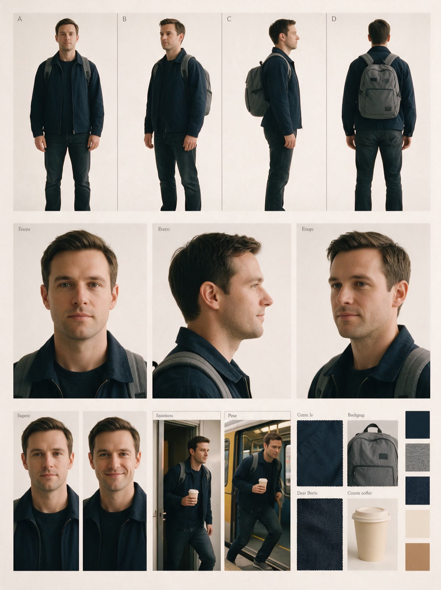
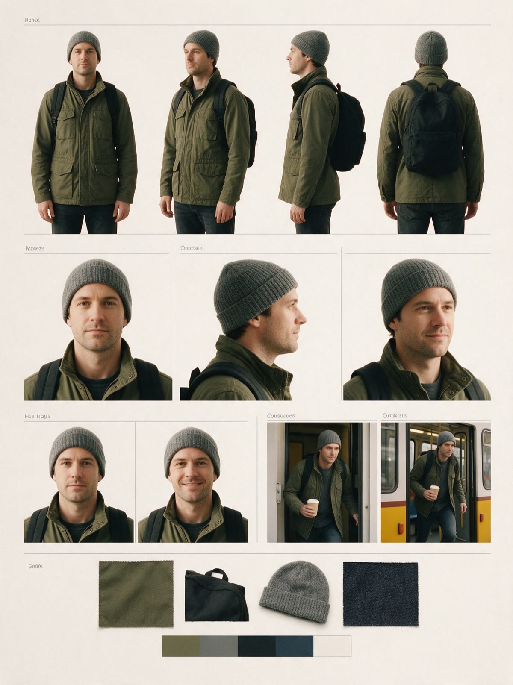
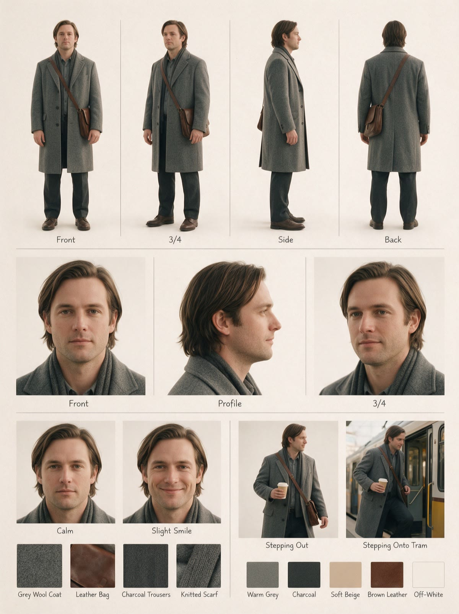

# Этап 2. Лист персонажа: «Минута до трамвая»

> Люди и бренд вымышленные, условно. Состав листа: `skills/ai-video-concept/templates/character-sheet.md`. Листы гостя ниже настоящие: сгенерированы в Seedream 5 Pro через Higgsfield по этому составу, лук `dark-roast` без грейда (на листе нужен точный цвет одежды).

| A | B | C |
|---|---|---|
|  |  |  |

Ролик смешанный: кофейню и бариста снимают вживую, улицу и гостя у
трамвая генерируют. Поэтому листов два разной глубины.

## Гость (генерация в кадре 11, съёмка со спины в кадре 10)

Главный лист проекта: гость появляется и в съёмке, и в генерации, и
должен совпасть. Лист делался от фото человека из команды, который
снимается в кадре 10 (согласие в `inbox/consent-guest.pdf`, условно).

**Состав листа** (по шаблону):

1. Профиль: «гость», около 30 лет, средний рост, спокойный, идёт на
   работу; фирменные цвета героя: тёмно-синий и серый.
2. Разворот: спереди, в три четверти, сбоку, со спины. Со спины важнее
   всего: в ролике гость виден только так.
3. Лицо в трёх ракурсах: для согласования, в ролике лица крупно нет.
4. Эмоции: спокойный, лёгкая улыбка.
5. Позы под сцены: выходит из двери со стаканом в правой руке (кадр 10),
   шагает в трамвай, стакан в той же руке (кадр 11).
6. Детали костюма: ткань куртки, лямки рюкзака, капюшон.
7. Палитра: куртка `#26344a`, рюкзак `#7a7d80`, джинсы `#3b4250`.
8. Не менять: фигура, причёска со спины, куртка и рюкзак во всех панелях.

**Три варианта.**

- **A**: тёмно-синяя куртка без логотипов, серый рюкзак, короткая стрижка.
- **B**: оливковая куртка, чёрный рюкзак, шапка.
- **C**: серое пальто, сумка через плечо.

**Выбор клиента** (условно): «A. Обычный человек, как у нас утром».
Пожелание из выбора направления («не слишком модный») закрыто вариантом A.

**Контраст с продуктом.** Стакан кремовый: на тёмно-синей куртке он
читается, на сером пальто (вариант C) терялся бы.

**Итерации после выбора.** Одна: рюкзак на листе вышел с крупной
нашивкой, похожей на чужой логотип. Перегенерирован лист с нуля с
формулировкой «рюкзак без нашивок и надписей», а не правкой i2i от листа
с нашивкой.

**В генерации кадра 11 идёт** не сам лист, а вырезанный крупный вид со
спины в три четверти: на сетке фигура занимает малую часть кадра.

## Бариста (съёмка, лист только костюма)

Реальный человек, не генерируется. Лист собран из фото на примерке, чтобы
выбрать костюм до съёмочного дня.

- Вариант 1: тёмный фартук, рубашка цвета овса, рукава закатаны.
- Вариант 2: тёмная футболка без надписей, фартук крем.
- Вариант 3: серый свитер, тёмный фартук.

Позы под сцены: темперует (кадр 5), протягивает стакан через стойку
(кадр 9). Вариант 2 не рекомендован: кремовый стакан на кремовом фартуке
потеряется. Клиент выбрал вариант 1.
