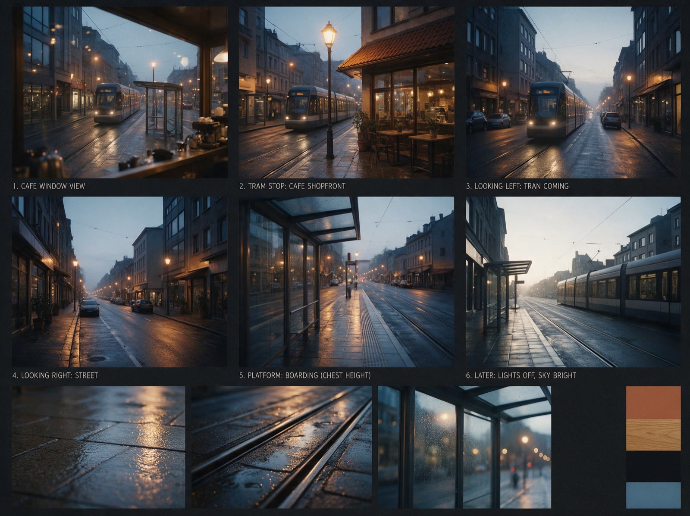
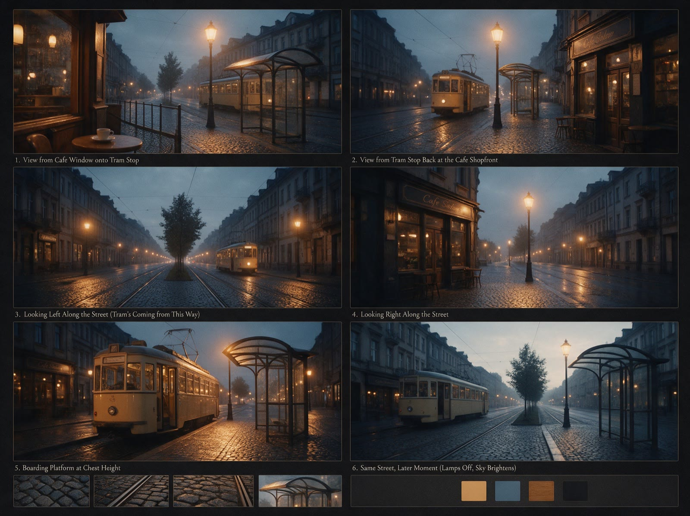

# Этап 3. Лист локации: «Минута до трамвая»

> Место и бренд вымышленные, условно. Состав листа: `skills/aivfx-concept/templates/location-sheet.md`. Листы улицы ниже настоящие: сгенерированы в Seedream 5 Pro через Higgsfield, лук `aivfx-dark-roast` с грейдом.

| B | C |
|---|---|
|  |  |

Кофейню снимают вживую, улицу за окном генерируют. Лист нужен затем,
чтобы генерация улицы совпала с видом из настоящего окна, а кадр 11 у
трамвая был той же улицей, что и кадр 3.

## Улица у остановки (генерация, кадры 3 и 11)

**Состав листа** (по шаблону, людей на листе нет):

1. Профиль: тихая улица у трамвайной остановки, рассвет, дождь, свет
   фонарей тёплый, небо холодное серо-синее.
2. Общие планы со всех сторон: из окна кофейни на остановку; от остановки
   на витрину кофейни; вдоль улицы влево (откуда приходит трамвай); вдоль
   улицы вправо. Брусчатка, фонари, навес остановки одинаковы во всех видах.
3. Зона действия: посадочная площадка остановки с высоты камеры из кадра
   11 (на уровне груди) и сверху.
4. Свет: два состояния из синопсиса: фонари горят, небо тёмное (кадр 3);
   фонари гаснут, светлеет (кадр 11).
5. Материалы крупно: мокрая брусчатка, стекло навеса, рельсы, бордюр.
6. Повторяющийся реквизит: старый красный трамвай, урна у навеса,
   табличка остановки без читаемого текста.
7. Палитра: небо `#3e4a5c`, фонари `#e0a25a`, брусчатка `#2e2b29`,
   трамвай `#9c2f2a`.
8. Не менять: положение остановки относительно окна, ширина улицы,
   фонари, трамвай идёт слева направо.

**Три варианта.**

- **A**: брусчатка, старый красный трамвай, низкие дома напротив.
- **B**: асфальт, современный трамвай, стеклянные витрины напротив.
- **C**: брусчатка, бульвар с деревьями между путями.

**Выбор клиента** (условно): «A, но трамвай как у нас». Трамвай на листе
уже старый; клиент прислал фото своего трамвая, оно легло в `inbox/` и
пошло вторым референсом листа. Новый вариант A2 утверждён.

**Грейд.** Улица тёмная и атмосферная, грейд `aivfx-dark-roast` оставлен.
Внутри кофейни в светлых сценах его бы сняли, но там съёмка.

## Кофейня (съёмка, лист из фото площадки)

Лист собран из фото на осмотре площадки, а не генерацией. Он нужен для
съёмочного плана и чтобы свет генерации совпал со стойкой.

- Вид от стойки на окно и дверь, вид от окна на стойку, вид от двери.
- Зона действия: стойка 2 метра, кофемолка слева, окно справа от бариста.
- Свет: тёплая лампа над стойкой, холодное окно контрой.
- Повторяющийся реквизит: кремовые чашки, медный питчер, деревянный
  подоконник (он есть и в генерации кадра 3).

## Что идёт в генерации

- Кадр 3: лист улицы A2 (вид из окна) плюс фото настоящего подоконника.
- Кадр 11: утверждённый кадр 3 плюс вырез гостя со спины из
  `02a-character-sheet.md`.
- Все референсы в PNG: загрузка JPEG падает с ошибкой только в логе, и
  генерация молча уходит без референса.
