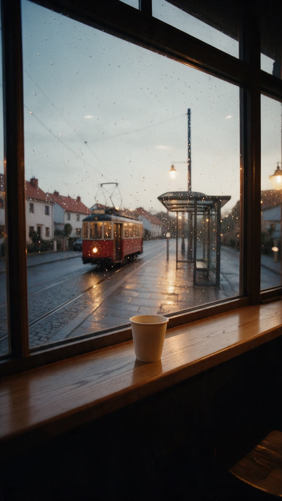

# Промпты ключевых кадров

> Бренд вымышленный, условно. Все промпты собраны реальным запуском `skills/aivfx-look/scripts/build_prompt.py` и проверены `check_prompt.py`. Сцена пишется своими словами, лук скрипт дописывает сам. Соотношение сторон передаётся параметром модели, в тексте промпта его нет.

Какой лук где:

- Кадры 3 и 11 (улица, трамвай, гость): `aivfx-dark-roast` с грейдом,
  это атмосферный кадр без жёстких цветов.
- Кадр 8 (стакан с логотипом): `neutral-product`. У стакана фирменный
  кремовый цвет и терракотовый логотип, тёплый грейд их бы увёл. Ядро у
  пресетов общее, поэтому кадр не выпадает из ролика.

Команды запускаются из корня репозитория.

## A. Кадр 3, статика: окно и трамвай (photo)

Черновик сцены писали быстро и оставили в нём `ultra detailed` и `4:3`.
Скрипт их вырезал и предупредил об этом.

```
$ python3 skills/aivfx-look/scripts/build_prompt.py --preset aivfx-dark-roast --model seedream --mode photo --aspect 9:16 "Early morning view from inside a small corner coffee shop through a rain-streaked window: a tram passes at dawn on a quiet street, wet cobblestones reflect the first streetlights, on the windowsill a ceramic cup with steam rising, empty space in the upper third of the frame for a title, no people in focus, natural imperfect sharpness, ultra detailed, 4:3." > prompt-a.txt
Внимание: убрал из текста сцены соотношение сторон: 4:3. Передавай его параметром модели (--aspect).
Внимание: убрал слова, которые ломают лук: ultra detailed
```

Готовый промпт (`prompt-a.txt`):

```
Early morning view from inside a small corner coffee shop through a rain-streaked window: a tram passes at dawn on a quiet street, wet cobblestones reflect the first streetlights, on the windowsill a ceramic cup with steam rising, empty space in the upper third of the frame for a title, no people in focus, natural imperfect sharpness. Shot on Arricam LT with Cooke S4/i primes, 35mm Kodak Vision3 500T, T2.8, shallow depth of field, halation on highlights, fine organic grain, lifted milky blacks, low contrast, no sharpening, no HDR. Dark Roast grade: terracotta-warm skin as the hero tone, honey-oak wood and amber tungsten pools, matte charcoal blacks, cool blue-grey window light, chromatic blue shadows.

Параметр модели: aspect_ratio=9:16
```

Последняя строка не часть промпта: это значение для поля соотношения
сторон в интерфейсе модели.

```
$ python3 skills/aivfx-look/scripts/check_prompt.py prompt-a.txt --preset aivfx-dark-roast --mode photo
Чисто: лук aivfx-dark-roast на месте, режим photo.
```

Код выхода 0. Сначала 3 варианта статики на выбор, анимация только от
утверждённого.

## B. Кадр 8, предметка: стакан с логотипом (photo)

Референс один: фронтальное фото настоящего стакана от клиента. Логотип
берётся с референса, текстом его не описываем.

```
$ python3 skills/aivfx-look/scripts/build_prompt.py --preset neutral-product --model nano-banana --mode photo --aspect 9:16 "Front packshot of a matte cream paper takeaway cup with a small terracotta logo stamp, exactly as in the reference photo of the real cup, standing on a pale oak counter, soft daylight from the left, plain warm grey wall behind, logo reproduced exactly from the reference, no random text, no extra logos." > prompt-b.txt
```

Готовый промпт (`prompt-b.txt`):

```
Front packshot of a matte cream paper takeaway cup with a small terracotta logo stamp, exactly as in the reference photo of the real cup, standing on a pale oak counter, soft daylight from the left, plain warm grey wall behind, logo reproduced exactly from the reference, no random text, no extra logos.

Shot on Arricam LT with Cooke S4/i primes, 35mm Kodak Vision3 500T, T2.8, shallow depth of field, halation on highlights, fine organic grain, lifted milky blacks, low contrast, no sharpening, no HDR. Neutral white balance, true-to-life product colours, no colour cast.

Параметр модели: aspect_ratio=9:16
```

```
$ python3 skills/aivfx-look/scripts/check_prompt.py prompt-b.txt --preset neutral-product --mode photo
Чисто: лук neutral-product на месте, режим photo.
```

Код выхода 0. После генерации зум на логотип: перепутанная буква или
упрощённая форма это брак, кадр переснимается на площадке (риск из
`03-preprod.md`).

## C. Кадр 3, оживление утверждённой статики (video)

Видео делается только от утверждённой статики A. Реплик в кадре нет,
поэтому режим `video`, а не `dialogue`: строка про синхрон заставила бы
модель искать говорящих.

```
$ python3 skills/aivfx-look/scripts/build_prompt.py --preset aivfx-dark-roast --model kling --mode video --aspect 9:16 "Animate the approved still: the tram slowly crosses the frame from left to right, raindrops run down the glass, steam from the cup drifts upward, the streetlights flicker off one by one as the sky gets lighter, 3 seconds, no people appear." > prompt-c.txt
```

Готовый промпт (`prompt-c.txt`):

```
Animate the approved still: the tram slowly crosses the frame from left to right, raindrops run down the glass, steam from the cup drifts upward, the streetlights flicker off one by one as the sky gets lighter, 3 seconds, no people appear.
Style: Shot on Arricam LT with Cooke S4/i primes, 35mm Kodak Vision3 500T, T2.8, shallow depth of field, halation on highlights, fine organic grain, lifted milky blacks, low contrast, no sharpening, no HDR. Dark Roast grade: terracotta-warm skin as the hero tone, honey-oak wood and amber tungsten pools, matte charcoal blacks, cool blue-grey window light, chromatic blue shadows. Handheld with micro-drift, never locked off.

Параметр модели: aspect_ratio=9:16
```

```
$ python3 skills/aivfx-look/scripts/check_prompt.py prompt-c.txt --preset aivfx-dark-roast --mode video
Чисто: лук aivfx-dark-roast на месте, режим video.
```

Код выхода 0. Строка движения камеры `Handheld with micro-drift` здесь к
месту: кадр снят «изнутри кофейни с рук», остальной ролик тоже ручной.

## D. Кадры по утверждённым листам: зачем вообще листы

Два кадра собраны в Seedream 5 Pro через Higgsfield. Референсы: лист улицы A и
лист гостя A, оба PNG. Лицо, куртка, рюкзак, красный трамвай и дома совпали с
листами без ручной правки. Без листов модель каждый раз рисует новое лицо и
новую улицу.

| Кадр 3: окно и трамвай | Кадр 11: гость входит в трамвай | Лист гостя A (референс) |
|---|---|---|
|  |  |  |

Кадр 3, референс `location-sheet-A.png`, параметр модели `aspect_ratio=9:16`:

```text
Use the location reference sheet for the street, tram stop, lamps and houses. Vertical shot from inside a small cafe: a wooden windowsill with a cream paper coffee cup in the foreground, rain drops on the glass, through the window the tram stop at dawn, warm street lamps still on, an old red tram approaching from the left. No people in the cafe, no readable text, no logos. Shot on Arricam LT with Cooke S4/i primes, 35mm Kodak Vision3 500T, T2.8, shallow depth of field, halation on highlights, fine organic grain, lifted milky blacks, low contrast, no sharpening, no HDR. Dark Roast grade: terracotta-warm skin as the hero tone, honey-oak wood and amber tungsten pools, matte charcoal blacks, cool blue-grey window light, chromatic blue shadows.
```

Кадр 11, референсы `character-sheet-A.png` и `location-sheet-A.png`, параметр модели `aspect_ratio=9:16`:

```text
Use the character reference sheet for the man: same face, short haircut, dark navy jacket without logos, grey backpack without patches, dark jeans. Use the location reference sheet for the street and the old red tram. Vertical shot from behind at three-quarter angle: the man steps up into the open door of the old red tram at the tram stop at dawn, a cream paper coffee cup in his right hand, wet cobblestones, warm lamps, light rain. No readable text, no logos. Shot on Arricam LT with Cooke S4/i primes, 35mm Kodak Vision3 500T, T2.8, shallow depth of field, halation on highlights, fine organic grain, lifted milky blacks, low contrast, no sharpening, no HDR. Dark Roast grade: terracotta-warm skin as the hero tone, honey-oak wood and amber tungsten pools, matte charcoal blacks, cool blue-grey window light, chromatic blue shadows.
```

Команда (Higgsfield CLI, референсы только PNG):

```bash
higgsfield generate create seedream_v5_pro --prompt "$(cat frame-11.txt)" \
  --image character-sheet-A.png --image location-sheet-A.png \
  --aspect_ratio 9:16 --resolution 2k --wait --json
```

## Перед запуском

- Платные генерации запускаются только после «да» владельца проекта.
- Референсы только в PNG: лист улицы, вырез гостя, фото стакана. Загрузка
  JPEG падает с ошибкой подписи хранилища в логе, но команда ошибку не
  возвращает, и генерация молча уходит без референса.
- После каждой пачки смотреть журнал инструмента на ошибки, а не только
  наличие файла: референс стакана мог не загрузиться молча.
- Ролик смешанный, поэтому оживляются два кадра по отдельности. Если бы
  генерировался весь ролик, видео шло бы одним промптом: шапка с героем,
  локацией и продуктом, шоты с таймкодами, лук хвостом.
- Модели в этом файле названы для примера. В документ для клиента
  названия моделей не попадают.
