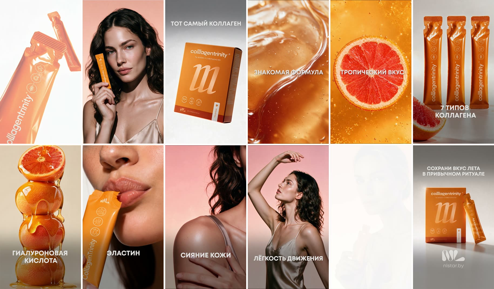

# CollagenTrinity Tropic: рекламный AI-ролик

Ролик студии AIVFX для запуска лимитированного тропического вкуса
CollagenTrinity (бренд NL). Вертикаль 9:16, 21 секунда, для Reels и Stories.

Нажми на раскадровку, чтобы открыть видео ([reel.mp4](reel.mp4), сжатая копия 720×1280).

## Как сделан

По конвейеру [`aivfx-concept`](../../skills/aivfx-concept/SKILL.md):

1. Бриф бренда: сценарий из сцен с тезисом на экране у каждой, реальные фото
   упаковки, мудборд.
2. Синопсис и концепция: бьюти-героини и макро вкуса вместо длинного сюжета.
3. Героиня: несколько вариантов, потом круги по образу и одежде. Утверждённая
   героиня идёт референсом во все её кадры.
4. Статика волнами: упаковка с реальных фото (по описанию её не генерируют),
   макро грейпфрута и геля, героини с продуктом, пэкшот.
5. Видео в Seedance 2.0 тремя частями с одной общей шапкой промпта: продукт
   строго как на референсах, живая кожа без пластика, только жёсткие склейки
   по форме, цвету и движению, без растворений.
6. Сборка: тезисы на экране моушеном на монтаже, а не внутри генерации.

Модели: Seedream 5 Pro через Higgsfield для статики, Seedance 2.0 для видео.
Лук: ядро плёночного лука без грейда Dark Roast, потому что у продукта
фирменный оранжевый цвет и его нельзя уводить.

Права на ролик и бренд принадлежат клиенту. Здесь он показан как пример
работы студии.
